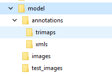
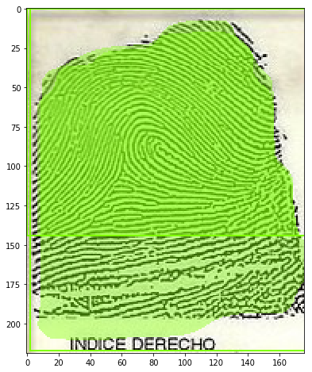
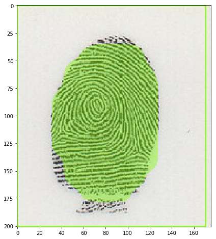

"# fingerprintmask" 


This is a custom mask rcnn sample to get only the fingerprint part of an image .  The result is a PB protobuff file that you can use in an android mobile.

I use Priya instructions but I give you the files that I have to modify and command line that I use in the process .

I test this in Windows 10 with Ubuntu linux subsystem for windows To run shell script commands

1. Install anaconda,. Cuda,. Tensorflow

[Install Object detection](https://www.youtube.com/watch?v=Rgpfk6eYxJA)
[Install Object detection Github](https://github.com/EdjeElectronics/TensorFlow-Object-Detection-API-Tutorial-Train-Multiple-Objects-Windows-10#2-set-up-tensorflow-directory-and-anaconda-virtual-environment)

```

conda create -n master pip python=3.6
activate master
pip uninstall setuptools
pip install --ignore-installed --upgrade setuptools==39.1.0
#pip install --ignore-installed --upgrade tensorflow-gpu
#conda install tensorflow-gpu==1.9

pip install --ignore-installed --upgrade tensorflow-gpu==1.9
conda install -c anaconda protobuf
pip install pillow
pip install contextlib2
pip install lxml
pip install Cython
pip install jupyter
pip install matplotlib
pip install pandas
pip install opencv-python
pip install git+https://github.com/philferriere/cocoapi.git#egg=pycocotools^&subdirectory=PythonAPI

set PYTHONPATH=D:\work\tensorflow\master-models;D:\work\tensorflow\master-models\research;D:\work\tensorflow\master-models\research\slim
set PATH=%PATH%;PYTHONPATH;C:\Program Files\NVIDIA GPU Computing Toolkit\CUDA\v9.0\bin;C:\Program Files\NVIDIA GPU Computing Toolkit\CUDA\v9.0\libnvvp;C:\Program Files\NVIDIA GPU Computing Toolkit\CUDA\v9.0\extras\CUPTI\libx64
D:
cd D:\work\tensorflow\master-models\research
protoc --python_out=. .\object_detection\protos\anchor_generator.proto .\object_detection\protos\argmax_matcher.proto .\object_detection\protos\bipartite_matcher.proto .\object_detection\protos\box_coder.proto .\object_detection\protos\box_predictor.proto .\object_detection\protos\eval.proto .\object_detection\protos\faster_rcnn.proto .\object_detection\protos\faster_rcnn_box_coder.proto .\object_detection\protos\grid_anchor_generator.proto .\object_detection\protos\hyperparams.proto .\object_detection\protos\image_resizer.proto .\object_detection\protos\input_reader.proto .\object_detection\protos\losses.proto .\object_detection\protos\matcher.proto .\object_detection\protos\mean_stddev_box_coder.proto .\object_detection\protos\model.proto .\object_detection\protos\optimizer.proto .\object_detection\protos\pipeline.proto .\object_detection\protos\post_processing.proto .\object_detection\protos\preprocessor.proto .\object_detection\protos\region_similarity_calculator.proto .\object_detection\protos\square_box_coder.proto .\object_detection\protos\ssd.proto .\object_detection\protos\ssd_anchor_generator.proto .\object_detection\protos\string_int_label_map.proto .\object_detection\protos\train.proto .\object_detection\protos\keypoint_box_coder.proto .\object_detection\protos\multiscale_anchor_generator.proto .\object_detection\protos\graph_rewriter.proto


cd D:\work\tensorflow\master-models\research\object_detection
```

### Test

python
import tensorflow as tf
sess = tf.Session(config=tf.ConfigProto(log_device_placement=True))

cd D:\work\tensorflow\master-models\research\object_detection
python builders\model_builder_test.py

2. Download tensorflow model revision 
[Github revision](https://github.com/tensorflow/models/tree/34beb7adfcd2f394e09acfecf05fdc0bdb8143c5)
D:\work\tensorflow\master-models

3. Download this project patch

D:\work\tensorflow\master-models\research\object_detection

4. Create Image files structure
<p align="center">
  
</p>
I found a problem in create tf py and I don't know how it works with other people.  I realized that the script is not writing the 0,. 1 mask correctly of the image crated by PixelAnnotationTool.
[PixelAnnotationTool](https://github.com/abreheret/PixelAnnotationTool)

Utils to create structure
```
find . -iname '*.jpg' | awk 'BEGIN{ a=0 }{ printf "mv \"%s\" fp_%02d.jpg\n", $0, a++ }' | bash
for file in *.png; do mv "$file" "${file/toy/toy_}"; done
sed -i "s/>toy/>toy_/g" *
rm -fr *color*.*
rm -fr *water*.*
mkdir trimaps
for file in *.png; do mv "$file" trimaps/"${file/_mask/}"; done

for file in *.xml; do mv "$file" ../annotations/xmls/"${file/_mask/}"; done
for file in *.jpg; do basename "${file}" | cut -d. -f1; done

```


5. Run create tf record
```
python dataset_tools\create_pet_tf_record.py --label_map_path=data/toy_label_map.pbtxt --data_dir=D:\work\tensorflow\master-models\research\object_detection\models\model --output_dir=data --include_masks=True

```

6. Train
```
set PIPELINE_CONFIG_PATH=D:\work\tensorflow\master-models\research\object_detection\models\model\mask_rcnn_inception_v2_coco.config
set MODEL_DIR=D:\work\tensorflow\master-models\research\object_detection\training
set NUM_TRAIN_STEPS=30
set NUM_EVAL_STEPS=3
python model_main.py --pipeline_config_path=%PIPELINE_CONFIG_PATH% --model_dir=%MODEL_DIR% --num_train_steps=%NUM_TRAIN_STEPS% --num_eval_steps=%NUM_EVAL_STEPS% --alsologtostderr

python legacy/train.py --logtostderr --train_dir=training/ --pipeline_config_path=%PIPELINE_CONFIG_PATH%
```

7. Monitor tensorboard convergence
```

tensorboard --logdir=training
```

8. Create inference PB file
```

python export_inference_graph.py --pipeline_config_path %PIPELINE_CONFIG_PATH% --trained_checkpoint_prefix  training/model.ckpt-17826 --output_directory inference_graph-17826
	
```

9. Test with jupyter
```
	
jupyter notebook  mask_rcnn_custom_images.ipynb	

```

<p align="center">
  
  
</p>


I hope this help you in your custom training

Let's train

Thanks

References
[Priya](https://towardsdatascience.com/building-a-custom-mask-rcnn-model-with-tensorflow-object-detection-952f5b0c7ab4)